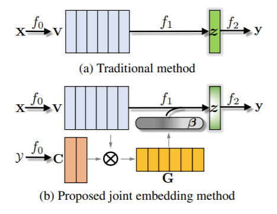
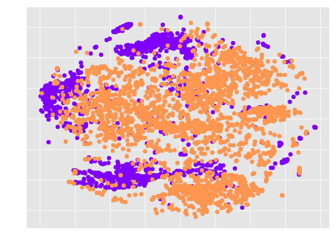
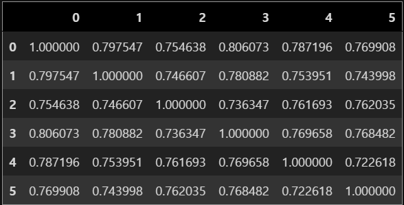

# leam-pytorch

Pytorch implementation Code implementation of [Joint Embedding of Words and Labels for Text Classification(LEAM)](https://www.aclweb.org/anthology/P18-1216.pdf)

### Data description

- yelp 2015
    - [download source](https://www.kaggle.com/luisfredgs/yelp-reviews-csv)
    - label : stars [0..5]
    - only used 1,000,000
    - label imbalanced is mitigated by over-sampling
        - each # of label is sampled to 289394
        
### Model description
- please refer the src/model.py in detail

- performance
    - VAL ACC : 0.713 | VAL LOSS : 0.702 at epoch 5

- word embedding(V) distribution
    - V has high-dimension [batch_size, max_length, hidden_dim]
    - I reduced dimension by averaging [batch_size, hidden_dim] (document vector)
    - I applied t-sne to reduce the embedding dimension [batch_size, 2]

- label embedding(C) cosine similarity matrix
    - C has dimension [label_num(6 in yelp review), hidden_dim]
    - cosine similarity is caculated 
 

